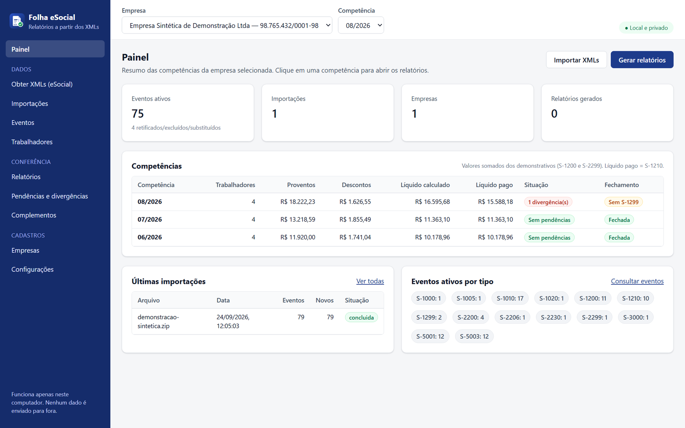
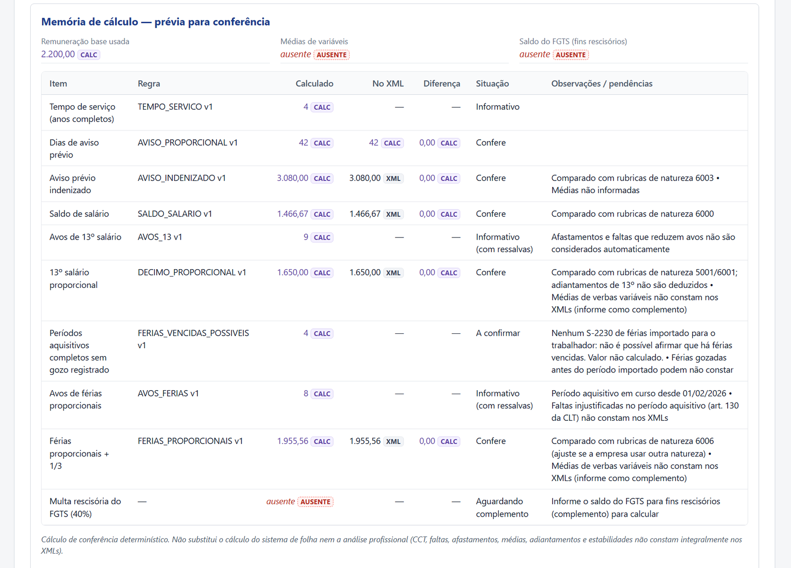
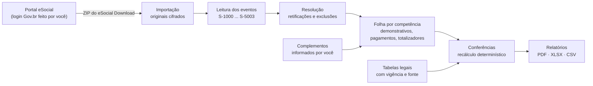
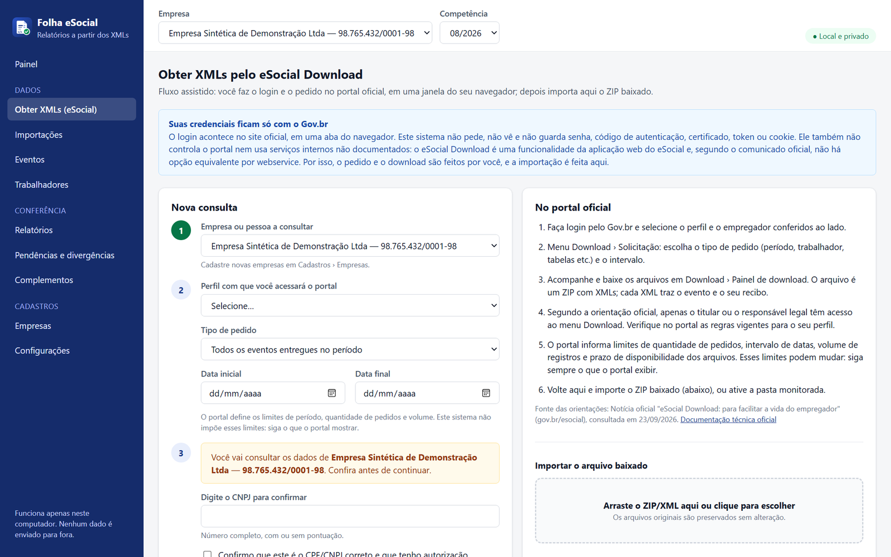
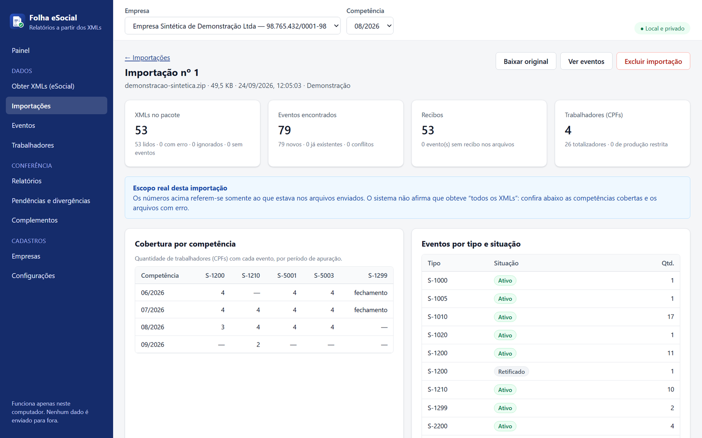
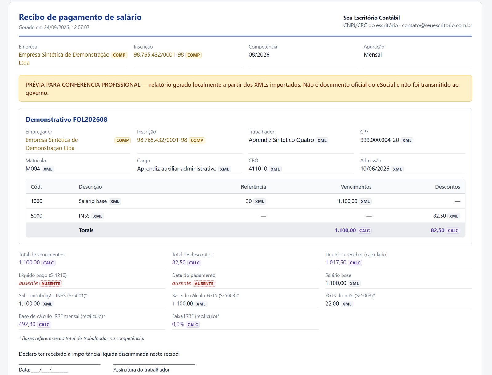
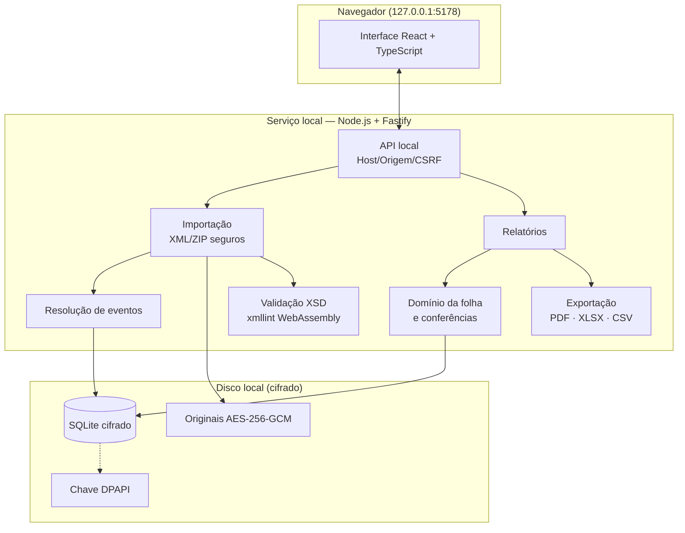

<p align="center">
  
</p>

<h1 align="center">Folha eSocial Local</h1>

<p align="center">
  <strong>Relatórios de folha de pagamento a partir dos XMLs do eSocial — com a origem de cada valor.</strong><br>
  Aplicação local, gratuita e de código aberto para escritórios contábeis e departamentos pessoais.
</p>

<p align="center">
  
  
  
  
  
  
</p>

<p align="center">
  <a href="https://fredabsd-svg.github.io/folha-esocial-local/"><strong>🌐 Página do projeto</strong></a> ·
  <a href="#-instalação">Instalação</a> ·
  <a href="#-guia-de-uso">Guia de uso</a> ·
  <a href="#-os-12-relatórios">Relatórios</a> ·
  <a href="#-segurança-e-privacidade">Segurança</a> ·
  <a href="docs/MAPA-DE-CAMPOS.md">Mapa de campos</a>
</p>

<p align="center">
  
</p>

---

## Sumário

- [O que é](#-o-que-é)
- [Principais recursos](#-principais-recursos)
- [Como funciona](#-como-funciona)
- [Instalação](#-instalação)
- [Primeiro uso em 2 minutos](#-primeiro-uso-em-2-minutos)
- [Guia de uso](#-guia-de-uso)
- [Os 12 relatórios](#-os-12-relatórios)
- [De onde vem cada valor](#-de-onde-vem-cada-valor)
- [Regras de cálculo e tabelas legais](#-regras-de-cálculo-e-tabelas-legais)
- [Segurança e privacidade](#-segurança-e-privacidade)
- [Backup, restauração e exclusão](#-backup-restauração-e-exclusão)
- [Arquitetura](#-arquitetura)
- [Desenvolvimento e testes](#-desenvolvimento-e-testes)
- [Limitações conhecidas](#-limitações-conhecidas)
- [Solução de problemas](#-solução-de-problemas)
- [Perguntas frequentes](#-perguntas-frequentes)
- [Aviso legal](#-aviso-legal)

---

## 💡 O que é

O **Folha eSocial Local** lê os arquivos XML do eSocial das empresas que você atende — normalmente o ZIP baixado pelo **eSocial Download** — e transforma esses eventos em relatórios de folha prontos para conferência: extrato mensal, movimentos, recibos, relação de líquidos, resumo mensal, férias, rescisão e outros.

O diferencial é a **rastreabilidade**: cada número mostrado tem um selo que diz de onde ele veio.

| Selo | Significa | Exemplo |
|---|---|---|
|  | Veio de um evento importado | Salário do S-2206 vigente, valor da rubrica no S-1200 |
|  | Calculado pelo sistema, com regra e versão | Total de proventos, INSS recalculado pela tabela |
|  | Complementado por você, com origem e data | Saldo do FGTS para a multa, data do aviso de férias |
|  | Não encontrado nos dados | Razão social (o S-1000 não traz), médias de variáveis |

> **Ausente nunca vira zero.** Quando falta um dado, o sistema mostra o que falta, marca o cálculo como incompleto e permite complementar.

Tudo roda **no seu computador**, pelo navegador, sem Docker, sem nuvem e sem enviar dados a ninguém.

## ✨ Principais recursos

- **Importação segura** de ZIP do eSocial Download, XMLs avulsos, lotes e ZIPs dentro de ZIPs. Os originais são guardados sem alteração (cifrados).
- **Deduplicação, retificação e exclusão**: reimportar não duplica; eventos retificados (`indRetif=2`) e excluídos (S-3000) saem das contas, mas continuam no histórico.
- **Conferência determinística**: líquido calculado × S-1210, bases do INSS × S-5001, FGTS × S-5003, IRRF recalculado × retido. Nenhuma IA decide valores.
- **Memória de cálculo de rescisão** por motivo de desligamento: aviso proporcional, saldo, 13º, férias e multa do FGTS.
- **Pendências automáticas**: vínculo sem remuneração, remuneração sem pagamento, competência sem S-1299, rubrica sem S-1010, duplicidades.
- **12 relatórios** exportáveis em **PDF, XLSX e CSV**, com a marca do seu escritório e histórico de exportações.
- **Fluxo assistido do eSocial Download**: confirmação do CPF/CNPJ e da autorização, abertura do portal oficial e importação do arquivo baixado — sem nunca pedir senha.
- **Validação XSD** com o pacote oficial de esquemas, localmente.
- **Privacidade por padrão**: banco cifrado, chave protegida pelo Windows, acesso só pelo próprio computador, logs sem dados pessoais.

<p align="center">
  
</p>

## 🧭 Como funciona



1. **Obter** — você pede os eventos no eSocial Download (portal oficial) e baixa o ZIP.
2. **Importar** — o sistema lê eventos, recibos e totalizadores, valida, deduplica e identifica retificações.
3. **Conferir** — veja divergências entre o XML e o recálculo e complemente o que o eSocial não recebe.
4. **Exportar** — gere os relatórios com a sua marca e guarde no histórico.

## 📦 Instalação

### Requisitos

| Item | Detalhe |
|---|---|
| Sistema | Windows 10 ou 11 (também funciona em macOS e Linux) |
| Node.js | Versão LTS **20 (≥ 20.19), 22 ou 24** — baixe em <https://nodejs.org> |
| Internet | Só na instalação, para baixar as dependências |
| Docker / Visual Studio | **Não são necessários** |

### Opção 1 — Windows, sem terminal (recomendado)

1. Clique em **Code → Download ZIP** nesta página e extraia o arquivo, por exemplo em `C:\Users\seu.usuario\Documentos\folha-esocial-local`.
2. Instale o [Node.js LTS](https://nodejs.org) (próximo, próximo, concluir).
3. Dê **dois cliques em `iniciar.bat`**.
   - Na primeira vez ele instala as dependências e compila (1 a 3 minutos).
   - Depois, abre o sistema no navegador em **<http://127.0.0.1:5178>**.
4. Para encerrar, feche a janela preta do `iniciar.bat`.

### Opção 2 — pelo terminal

```bash
git clone https://github.com/fredabsd-svg/folha-esocial-local.git
cd folha-esocial-local
npm run setup
npm start
```

`npm run setup` instala e compila; `npm start` inicia o serviço e abre o navegador.

### Configurações opcionais

| Variável de ambiente | Efeito |
|---|---|
| `FOLHA_PORTA=5200` | Usa outra porta em vez de 5178 |
| `FOLHA_DADOS_DIR=D:\FolhaDados` | Guarda os dados em outra pasta (use caminho curto: o Windows limita a 260 caracteres) |
| `FOLHA_SEM_NAVEGADOR=1` | Não abre o navegador ao iniciar |

## 🚀 Primeiro uso em 2 minutos

1. Abra o sistema e, no **Painel**, clique em **Carregar demonstração com dados fictícios**.
2. Será criada uma empresa sintética com 4 trabalhadores fictícios (competências 06 a 08/2026), com retificação, exclusão por S-3000, férias, rescisão, aprendiz e uma **divergência proposital** de R$ 10,00.
3. Vá em **Pendências e divergências** e veja a divergência e o S-1210 ausente apontados.
4. Vá em **Relatórios → Relatório de rescisão → Visualizar prévia** e clique nos selos para ver a origem de cada valor.
5. Quando quiser, exclua a demonstração em **Cadastros → Empresas → Excluir dados**.

## 📖 Guia de uso

### 1. Cadastre as empresas

Menu **Cadastros → Empresas**. As empresas encontradas nos XMLs aparecem sozinhas. Complete com a **razão social** (o S-1000 do leiaute S-1.x não traz esse campo), o CNPJ completo e o perfil de acesso ao eSocial. CNPJ **alfanumérico** é aceito.

### 2. Obtenha os XMLs pelo eSocial Download

Menu **Obter XMLs (eSocial)**:

1. Escolha a empresa, o perfil (titular, responsável legal ou procurador), o tipo e o período do pedido.
2. **Digite o CPF/CNPJ para confirmar** e marque a declaração de autorização. A solicitação fica registrada com data e hora.
3. Clique em **Registrar e abrir o portal oficial**: o portal (`https://login.esocial.gov.br`) abre numa nova aba e **o login Gov.br é feito por você**.
4. No portal: **Download → Solicitação** e, quando pronto, **Download → Painel de download**.
5. Volte ao sistema e importe o ZIP — ou ative a **pasta monitorada** (por exemplo, sua pasta Downloads).

<p align="center"></p>

> **Por que o sistema não entra no portal sozinho?** O comunicado oficial informa que o eSocial Download é uma função da aplicação web e não existe por webservice. Automatizar exigiria controlar a sessão do Gov.br — o que o sistema **não faz**. Ele nunca pede, vê ou guarda senha, código, certificado, token ou cookie, e não usa serviços internos não documentados.
>
> Segundo a orientação oficial, o menu Download é restrito ao **titular ou responsável legal**; se você é procurador, confira no portal se o seu perfil tem acesso. Limites de pedidos, período, volume e prazo são definidos pelo portal e podem mudar — siga o que ele exibir.

### 3. Importe

Menu **Importações**: arraste ZIPs ou XMLs. Para cada importação você vê o **escopo real**: quantos XMLs havia no pacote, quantos foram lidos, com erro ou ignorados, quantos eventos são novos, repetidos ou em conflito, quantos estão sem recibo e a cobertura por competência. O sistema **nunca afirma ter obtido "todos os XMLs"**.

<p align="center"></p>

### 4. Confira pendências e divergências

Menu **Pendências e divergências**: tudo o que o sistema encontrou na competência — divergências entre o XML e o recálculo, eventos ausentes, dados não encontrados e cálculos incompletos. Os XMLs nunca são alterados.

### 5. Gere e exporte relatórios

Menu **Relatórios**: escolha o modelo, ajuste competência, trabalhador, agrupamento e ordenação, clique em **Visualizar prévia** e exporte em **PDF**, **XLSX** ou **CSV**.

- **Configurar modelo**: título próprio e colunas visíveis por relatório.
- **Configurações → Marca**: nome, CNPJ/CRC e logotipo do seu escritório no cabeçalho.
- **Histórico**: todos os arquivos exportados ficam guardados (cifrados) para baixar de novo.
- Dica: o endereço `#/relatorios/<tipo>/previa` abre a prévia direto (ex.: `#/relatorios/rescisao/previa`).

<p align="center"></p>

### 6. Complemente o que o eSocial não tem

Na prévia, clique no selo **AUSENTE** de um campo complementável e informe o valor e a **origem** (ex.: "Extrato do FGTS Digital de 20/08/2026"). O valor passa a aparecer como **COMP** e os cálculos que dependiam dele são refeitos. Tudo fica registrado em **Complementos**, com histórico.

### 7. Mantenha as tabelas legais

Menu **Configurações → Tabelas de cálculo**: INSS, IRRF (com redutor), FGTS, salário mínimo e aviso prévio, cada um com **vigência, versão e fonte**. Quando sair uma nova portaria ou lei, edite o JSON pela tela — ele é validado antes de ser aceito.

### 8. Valide contra o XSD oficial (opcional)

Menu **Configurações → Esquemas XSD**: importe o pacote de esquemas da [Documentação Técnica do eSocial](https://www.gov.br/esocial/pt-br/documentacao-tecnica). Cada evento é validado contra o XSD da sua versão de leiaute, localmente.

## 📊 Os 12 relatórios

| Relatório | O que traz |
|---|---|
| **Extrato mensal** | Empresa, competência, trabalhador, vínculo, situação, cargo, salário, rubricas, proventos, descontos, bases, líquido e conferências |
| **Movimentos** | Rubricas por trabalhador: código, descrição, referência, valor informado, valor calculado, tipo, estabelecimento/lotação, subtotais e totais |
| **Recibo de pagamento** | Holerite por demonstrativo: vencimentos, descontos, líquido, bases e assinatura |
| **Relação geral dos líquidos** | Líquido por pessoa (pago no S-1210 ou calculado, sinalizado), grupos, quantidade de pessoas e total |
| **Resumo mensal da folha** | Rubricas em proventos/descontos/informativas, quantidade de trabalhadores, totais, bases, S-5011 e fechamento |
| **Aviso e recibo de férias** | Períodos aquisitivo e de gozo (S-2230), rubricas de férias, bases, IRRF de férias e ciência |
| **Relatório de rescisão** | Dados do S-2299, verbas, prazo de pagamento, bases e **memória de cálculo** por motivo |
| **Admissões e desligamentos** | Movimentação no período |
| **Remunerações e pagamentos** | Líquido calculado × pago por competência e demonstrativo |
| **Rubricas por competência** | Matriz rubrica × mês |
| **Eventos ausentes e pendências** | O que falta importar ou transmitir |
| **Divergências** | Líquido, bases, INSS, FGTS e IRRF: XML × recálculo |

Os sete primeiros seguem os modelos de referência pedidos para o projeto; os demais são relatórios adicionais. No **XLSX**, a aba *Origem dos dados* lista a procedência de cada célula; no **PDF**, cores e legenda identificam a origem, e a marca d'água "PRÉVIA" identifica o documento.

## 🔎 De onde vem cada valor

O mapa campo a campo de todos os relatórios está em **[docs/MAPA-DE-CAMPOS.md](docs/MAPA-DE-CAMPOS.md)** (também na aba *Relatórios → Mapa de campos*). Resumo:

<details>
<summary><strong>Vem dos XMLs</strong></summary>

| Informação | Evento |
|---|---|
| Inscrição do empregador | todos os eventos (`ideEmpregador`) |
| Classificação tributária | S-1000 |
| Estabelecimentos e lotações | S-1005, S-1020 |
| Rubricas: descrição, natureza, tipo e incidências CP/IRRF/FGTS | S-1010 vigente na competência |
| Nome, nascimento, dependentes para IRRF | S-2200, S-2205 |
| Admissão, cargo, CBO, salário, categoria | S-2200 e S-2206 vigente |
| Afastamentos e férias (com período aquisitivo) | S-2230 |
| Desligamento: motivo, aviso, projeção, verbas | S-2299 |
| Itens da remuneração: código, quantidade, fator, valor, estabelecimento/lotação | S-1200 |
| Líquido pago e data de pagamento | S-1210 |
| Bases e contribuição calculadas pelo eSocial | S-5001 |
| Base e depósito do FGTS | S-5003 |
| Totalizadores da empresa | S-5011, S-5013 |
| Fechamento / reabertura | S-1299, S-1298 |
| Recibos | retorno do processamento |

</details>

<details>
<summary><strong>Calculado pelo sistema</strong></summary>

| Regra | O que calcula |
|---|---|
| `TOTAIS_DEMONSTRATIVO`, `LIQUIDO` | Proventos, descontos e líquido |
| `BASE_INSS_RUBRICAS`, `INSS_PROGRESSIVO` | Base do INSS pelas incidências e INSS pela tabela vigente |
| `BASE_FGTS_RUBRICAS`, `FGTS_DEPOSITO` | Base e depósito do FGTS (8%; 2% para aprendiz) |
| `IRRF_PROGRESSIVO` | IRRF com dependentes, desconto simplificado, redutor da Lei 15.270/2025 e dispensa até R$ 10 |
| `SITUACAO_COMPETENCIA`, `DIAS_GOZO`, `DATA_RETORNO` | Situação na competência e datas das férias |
| `AVISO_PROPORCIONAL`, `SALDO_SALARIO`, `AVOS_13`, `AVOS_FERIAS`, `DECIMO_PROPORCIONAL`, `FERIAS_PROPORCIONAIS`, `MULTA_FGTS`, `PRAZO_PAGAMENTO_RESCISAO` | Memória de cálculo da rescisão |

</details>

<details>
<summary><strong>Precisa ser complementado (não é transmitido ao eSocial)</strong></summary>

- Razão social da empresa (o S-1000 do leiaute S-1.x não traz)
- Data do aviso de férias e dias de abono pecuniário
- Médias de verbas variáveis (férias e rescisão)
- Saldo do FGTS para fins rescisórios (para a multa)
- Nome do trabalhador, quando não há S-2200/S-2205/S-2300 nem `infoComplem`

Não constam nos XMLs e deixam cálculos marcados como **incompletos**: faltas injustificadas, jornada/ponto, convenção coletiva, adiantamentos de 13º, férias gozadas antes do período importado e vínculos em outras empresas.

</details>

## 🧮 Regras de cálculo e tabelas legais

- As regras são **determinísticas, versionadas e documentadas** — cada valor calculado mostra a regra, a versão, a fórmula, os parâmetros e a tabela usada.
- As tabelas padrão (conferidas até 28/08/2026) cobrem **INSS 2024 a 2026** e **IRRF desde 02/2024**, incluindo o **redutor da Lei 15.270/2025** a partir de 01/2026.
- Competência sem tabela cadastrada gera cálculo **incompleto** — o sistema nunca aplica tabela de outro período.
- Tolerância de conferência configurável (padrão R$ 0,01); diferenças de até R$ 0,05 aparecem como "arredondamento".

| Exemplo de conferência | Resultado |
|---|---|
| INSS sobre R$ 3.000,00 em 2026 | R$ 248,60 (3.000 × 12% − 111,40) |
| IRRF sobre R$ 6.000,00 em 2026 | redutor de R$ 179,75 (exemplo oficial da RFB) |
| Aviso prévio de quem tem 4 anos completos | 42 dias (Lei 12.506/2011) |

## 🔐 Segurança e privacidade

| Tema | Como funciona |
|---|---|
| Onde ficam os dados | `%LOCALAPPDATA%\FolhaESocialLocal` (ou `FOLHA_DADOS_DIR`) — veja em **Configurações → Dados** |
| Banco | SQLite cifrado (SQLite3 Multiple Ciphers, ChaCha20-Poly1305) |
| Arquivos originais e relatórios | AES-256-GCM |
| Chave-mestra | Protegida pela **DPAPI do Windows**: só o mesmo usuário, no mesmo computador, abre os dados |
| Rede | Escuta **só em 127.0.0.1**; validação de Host (contra DNS rebinding), Origem e cabeçalho próprio (contra CSRF); CSP restritiva; sem CORS |
| Envio externo | **Nenhum.** Sem telemetria, sem chamadas a serviços externos; a interface não carrega fontes ou scripts de terceiros |
| Credenciais | Senha Gov.br, código, certificado, token e cookie **nunca** são pedidos nem armazenados |
| Logs | Só método, rota, status e tempo — nunca CPF, nome, salário ou XML |
| Arquivos temporários | Nenhum: ZIPs são lidos em memória, sem extrair para o disco |
| Arquivos maliciosos | XML com DOCTYPE/ENTITY recusado (XXE), entradas de ZIP com `..` ou caminho absoluto recusadas, limites contra "zip bomb" |

## 💾 Backup, restauração e exclusão

- **Backup**: *Configurações → Dados → Gerar backup*. Cria um arquivo `.folhabak` cifrado com uma senha escolhida por você (scrypt + AES-256-GCM). **A senha não é guardada** — sem ela não há como restaurar.
- **Restauração**: *Restaurar backup…*, informando a senha e digitando `SUBSTITUIR`. Serve também para levar os dados a outro computador ou usuário.
- **Exclusão**: por importação (*Importações → Excluir*), por empresa (*Empresas → Excluir dados*) ou total (*Configurações → Dados → Excluir todos os dados*, que apaga banco, originais, relatórios, esquemas e a chave).

## 🏗️ Arquitetura



```
folha-esocial-local/
├─ iniciar.bat              inicialização com dois cliques (Windows)
├─ server/                  serviço local (Node.js + TypeScript + Fastify)
│  ├─ src/xml/              leitura segura de XML e ZIP
│  ├─ src/esocial/          catálogo, extração de eventos, retificações e exclusões
│  ├─ src/importacao/       importação e histórico
│  ├─ src/dominio/          cadastros vigentes, folha por competência, conferências
│  ├─ src/calculo/          tabelas com vigência e regras determinísticas
│  ├─ src/relatorios/       os 12 relatórios e o mapa de campos
│  ├─ src/exportacao/       PDF (pdfmake), XLSX (exceljs), CSV
│  ├─ src/xsd/              validação XSD
│  ├─ src/seguranca/        criptografia e DPAPI
│  ├─ src/demo/             gerador de dados SINTÉTICOS
│  └─ test/                 testes automatizados (vitest)
├─ web/                     interface (React + TypeScript + Vite)
├─ docs/                    landing page (GitHub Pages) e mapa de campos
└─ exemplos-sinteticos/     arquivos de exemplo sem dados reais
```

## 🧪 Desenvolvimento e testes

```bash
npm run dev             # serviço + interface com recarga automática (http://127.0.0.1:5173)
npm test                # 47 testes automatizados
npm run build           # compila serviço e interface
npm run gerar-exemplos  # gera arquivos sintéticos e atualiza docs/MAPA-DE-CAMPOS.md
```

Os testes usam **apenas dados sintéticos** e cobrem:

1. Importação de XML, ZIP e ZIP aninhado
2. Identificação de eventos e validação XSD (válido, inválido e sem esquema)
3. Deduplicação, conflito, retificação, exclusão por S-3000 e preservação do histórico
4. Mapeamento dos 12 relatórios com a origem de cada valor
5. INSS, IRRF (incluindo o exemplo oficial do redutor), FGTS, avos, aviso, saldo, líquidos e ausências
6. Exportação em PDF, XLSX e CSV e histórico cifrado
7. Funcionamento local em 127.0.0.1 e bloqueio de Host, Origem e requisições sem o cabeçalho próprio
8. Nenhuma chamada de rede, nenhum campo de credencial, arquivos em disco sem dados legíveis, logs sem dados pessoais, backup/restauração e DPAPI

## ⚠️ Limitações conhecidas

- **Tabelas de códigos**: o catálogo em `server/src/esocial/catalogo.ts` descreve só os códigos usados pelas regras; os demais aparecem pelo número. Confira sempre as tabelas do leiaute vigente.
- **Rescisão**: a comparação por natureza usa 6000 (saldo), 6003 (aviso indenizado), 5001/6001 (13º) e 6006 (férias proporcionais). Se a empresa usar outras naturezas, aparece "sem valor no XML".
- **IRRF**: conferido por competência, mas o imposto segue o regime de caixa (data do S-1210); o relatório avisa. O redutor sobre férias pagas em separado está marcado como "conferir orientação da RFB".
- **INSS**: trabalhadores com múltiplos vínculos (`infoMV`) e categorias fora da regra progressiva do empregado não são recalculados.
- **13º anual** (`indApuracao=2`): suporte básico, sem a conferência do INSS do 13º (o 13º pago na rescisão é conferido).
- **Fora do escopo**: RPPS (S-1202/S-1207) e processos trabalhistas (S-2500) são importados e consultáveis, mas não entram nos relatórios.

## 🛠️ Solução de problemas

| Sintoma | O que fazer |
|---|---|
| "Não foi possível abrir o banco…" | Caminho de dados longo demais ou sem permissão: use `FOLHA_DADOS_DIR` com caminho curto |
| Os dados não abrem em outro usuário do Windows | A chave é protegida por usuário (DPAPI). Gere um backup `.folhabak` e restaure no novo usuário |
| Porta ocupada | Defina `FOLHA_PORTA` |
| Erro ao instalar o SQLite cifrado | Use Node.js 20, 22 ou 24 (há binário pré-compilado para essas versões) |
| O navegador não abriu | Acesse manualmente <http://127.0.0.1:5178> |

## ❓ Perguntas frequentes

<details>
<summary><strong>Os relatórios são documentos oficiais do eSocial?</strong></summary>

Não. São **prévias para conferência profissional**, identificadas com marca d'água. Nada é transmitido, alterado ou excluído no eSocial.
</details>

<details>
<summary><strong>O sistema precisa da minha senha do Gov.br ou do certificado?</strong></summary>

Não. O login no eSocial é feito por você, no site oficial, numa aba do seu navegador. O sistema só registra a solicitação e importa o arquivo que você baixar.
</details>

<details>
<summary><strong>Posso usar com vários clientes?</strong></summary>

Sim. Cada empresa (CNPJ/CPF do empregador) fica separada; troque a empresa e a competência no topo da tela.
</details>

<details>
<summary><strong>Meus dados vão para a internet?</strong></summary>

Não. O serviço só aceita conexões do próprio computador e não faz nenhuma chamada externa. Há um teste automatizado que bloqueia a rede e verifica isso.
</details>

<details>
<summary><strong>E quando mudar a tabela do INSS ou do IRRF?</strong></summary>

Atualize em *Configurações → Tabelas de cálculo*. As tabelas têm vigência, versão e fonte; o código não precisa ser alterado.
</details>

## ⚖️ Aviso legal

Este projeto **não é afiliado** ao Governo Federal, à Receita Federal, ao Ministério do Trabalho ou ao eSocial. Os cálculos servem para **conferência** e não substituem o sistema de folha nem a análise profissional — convenções coletivas, faltas, médias, afastamentos e outras informações podem não constar nos XMLs. Os dados de exemplo e de teste são **totalmente fictícios**.

---

<p align="center">
  <br>
  <sub>Feito para escritórios contábeis e departamentos pessoais · <a href="https://fredabsd-svg.github.io/folha-esocial-local/">página do projeto</a></sub>
</p>
